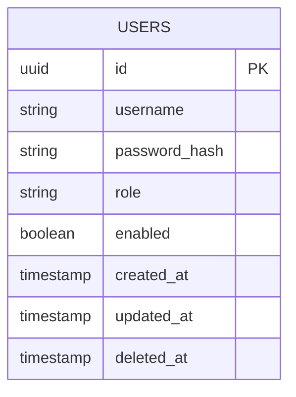

# Database Design

## System Architecture
**Database Engine**: PostgreSQL (v14+)

## Overview
This document outlines the database schema for the Gemini Web UI. We use PostgreSQL as our primary data store to ensure ACID compliance and robust relational mapping.

## Tables

### `users`
Stores user account information and authentication state.

| Column | Type | Description |
| :--- | :--- | :--- |
| `id` | UUID | Primary Key (Default: gen_random_uuid()) |
| `username` | VARCHAR(255) | Unique login name |
| `password_hash` | TEXT | Argon2 or BCrypt hash of the password |
| `role` | VARCHAR(50) | User role (e.g., 'admin', 'user') |
| `enabled` | BOOLEAN | Account status (Default: true) |
| `failed_login_attempts` | INTEGER | Counter for security lockout (Default: 0) |
| `lockout_until` | TIMESTAMP | Timestamp until which login is barred |
| `created_at` | TIMESTAMP | Record creation time |
| `updated_at` | TIMESTAMP | Last time the record was modified |
| `last_login_at` | TIMESTAMP | Last successful login timestamp |
| `password_last_set_at` | TIMESTAMP | Last time the password was changed |
| `deleted_at` | TIMESTAMP | Soft delete timestamp (NULL if active) |

## Relationships

## Security Considerations
- **Passwords**: Never store plain-text passwords. Use a strong hashing algorithm.
- **Lockout**: After 5 failed attempts, the `lockout_until` should be set to 15 minutes in the future.
- **Soft Deletes**: Consider adding `deleted_at` if data retention for audit is required.
